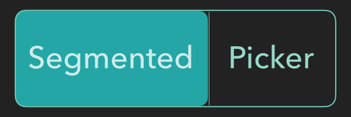

<p align="center">


<p align="center">
    
    
    
    
</p>

<p align="center">
    
</p>

Use the SegmentedPicker library to create custom vertical or horizontal `SegmentedPicker`s. Follow along with the examples below to get started quickly. 

```swift 
import SwiftUI
import SegmentedPicker
import Shapes


struct LineCapPicker: View {
    @State var lineCap: LineCap = .butt
    
    
    enum LineCap: String, CaseIterable, Identifiable {
        case butt = "butt"
        case round = "round"
        case square = "square"
        
        var id: String { self.rawValue }
        
        var cgLineCap: CGLineCap {
            switch self {
            case .butt:
                return .butt
            case .round:
                return .round
            case .square:
                return .square
            }
        }
    }
    
    var body: some View {
        SegmentedPicker($lineCap, LineCap.allCases, isVertical: true) { (cap: LineCap)   in
            HorizontalLine()
                .stroke(Color(white: 0.85), style: StrokeStyle(lineWidth: 20, lineCap: cap.cgLineCap))
                .frame(width: 40)
            
        }.overlay(RoundedRectangle(cornerRadius: 5).stroke(Color.green))
            .frame(height: 120)
    }
}


struct RGBColorSpacePicker: View {
    let colorSpaces: [String] = ["sRGB", "sRGB Linear", "Display P3"]
    @State var selected: String = "sRGB"
    
    var body: some View {
        SegmentedPicker($selected, colorSpaces) { (text: String)   in
            Text(text)
        }.overlay(RoundedRectangle(cornerRadius: 5).stroke(Color.green))
    }
}

struct TextAlignmentPicker: View {
    @State var alignment: TextAlignmentEnum = .left
    
    enum TextAlignmentEnum: String, CaseIterable, Identifiable {
        case left = "text.alignleft"
        case center = "text.aligncenter"
        case right = "text.alignright"
        var id: String {rawValue}
        
        var alignment: TextAlignment {
            switch self {
            case .left:
                return .leading
            case .center:
                return .center
            case .right:
                return .trailing
            
            }
        }
    }
    
    
    var body: some View {
        SegmentedPicker($alignment, TextAlignmentEnum.allCases) { (alignment)   in
            Image(systemName: alignment.rawValue)
        }.overlay(RoundedRectangle(cornerRadius: 5).stroke(Color.green))
    }
}


struct SegmentedPickerExample: View {
    
    var body: some View {
        ZStack {
            Color(white: 0.1)
                .edgesIgnoringSafeArea(.all)
            VStack {
                Text("RGB Color Space").padding()
                RGBColorSpacePicker()
                Divider()
                Text("Text Alignment").padding()
                TextAlignmentPicker()
                Divider()
                Text("Line Cap").padding()
                LineCapPicker()
            }
        }.navigationBarTitle("Segmented Picker")
        
    }
}

struct ContentView: View {
    var body: some View {
        SegmentedPickerExample()
    }
}

struct ContentView_Previews: PreviewProvider {
    static var previews: some View {
        ContentView().colorScheme(.dark)
    }
}
```
